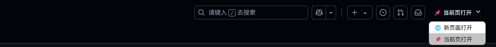

[🇨🇳 简体中文](#简体中文) | [🇺🇸 English](#english)

# GitHub 新标签页打开

  
  <h3>为 GitHub 添加新标签页打开功能</h3>
  
一个优雅的浏览器脚本，让 GitHub 链接默认在新标签页中打开，提升浏览体验

  
  
  
  

## ✨ 功能

- 在 GitHub 上浏览时，所有链接默认在新标签页中打开
- 在页面右上角提供一个现代化的下拉菜单，可随时切换链接打开方式
- 美观的 UI，完美融入 GitHub 原生界面
- 设置自动保存，浏览器重启后仍然保持

## 🎬 预览

## 🚀 安装方法

1. 首先安装浏览器扩展 [Tampermonkey](https://www.tampermonkey.net/)
2. 点击下面的安装链接：

[📦 点击安装脚本](https://www.tampermonkey.net/script_installation.php#url=https://update.greasyfork.org/scripts/535632/GitHub%20%E6%96%B0%E6%A0%87%E7%AD%BE%E9%A1%B5%E6%89%93%E5%BC%80.user.js)

## 💡 使用说明

安装后无需配置，脚本将自动在 GitHub 页面上生效。通过页面右上角的下拉菜单可以随时切换链接的打开方式：

- 🌐 **新页面打开**：所有链接将在新标签页中打开
- 📌 **当前页打开**：恢复默认行为，在当前页面打开链接

## 🛠️ 技术详情

- 使用 Tampermonkey API 存储用户设置
- 针对 GitHub 深色/浅色主题自适应
- 使用 MutationObserver 处理动态加载的内容

## 🤝 贡献

欢迎提交 Issue 或 Pull Request 来改进这个脚本！

## 📜 许可证

[MIT License](LICENSE) © Buggo404

---

# GitHub New Tab Links

  
  <h3>Add New Tab Opening Feature for GitHub</h3>
  
An elegant browser script that makes GitHub links open in new tabs by default, enhancing your browsing experience.

  
  
  
  

## ✨ Features

- All links on GitHub open in a new tab by default
- Modern dropdown menu at the top right for switching link opening behavior anytime
- Beautiful UI, seamlessly integrated with GitHub's native interface
- Settings are auto-saved and persist after browser restart

## 🎬 Preview

## 🚀 Installation

1. First, install the [Tampermonkey](https://www.tampermonkey.net/) browser extension
2. Click the link below to install the script:

[📦 Install Script](https://www.tampermonkey.net/script_installation.php#url=https://update.greasyfork.org/scripts/535632/GitHub%20%E6%96%B0%E6%A0%87%E7%AD%BE%E9%A1%B5%E6%89%93%E5%BC%80.user.js)

## 💡 Usage

No configuration needed after installation. The script will automatically take effect on GitHub pages. You can switch the link opening mode anytime via the dropdown menu at the top right:

- 🌐 **Open in New Tab**: All links will open in a new tab
- 📌 **Open in Current Tab**: Restore default behavior, open links in the current page

## 🛠️ Technical Details

- Uses Tampermonkey API to store user settings
- Adapts to GitHub's dark/light themes
- Handles dynamically loaded content with MutationObserver

## 🤝 Contributing

Feel free to submit Issues or Pull Requests to improve this script!

## 📜 License

[MIT License](LICENSE) © Buggo404